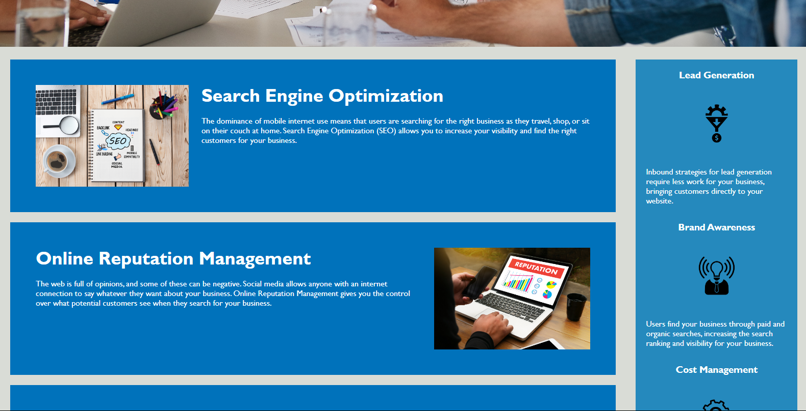

# challenge-1

## Description

The first challenge assignment from a bootcamp where the task was to refactor the code without changing the appearance of the website to be optimized search engines.

## Process

The refactoring process included taking a group of classes and changing them all to the same single class due to the styles in CSS being identical. Alt was added to the images for accessibility. The order of the elements were changed to be in a logical order. The div elements were changed to semantic elements. The title was changed to Horiseon, the name of the site.

## Links

Link to website used for this challenge.
https://mackemo.github.io/challenge-1/

Link to public Github repository for this challenge.
https://github.com/mackemo/challenge-1

## Installation

N/A

## Usage

This site was a practice assignment for bootcamp students but can be used to see refactored code when inspecting the site and looking at the code.

## Credits

N/A

## License

N/A

## Acknowledgement

Project was done by the knowledge learned from bootcamp instructor John.